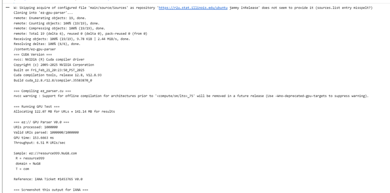

# ez-gpu-parser
GPU-parallel parser for ez:// 3-label URI scheme. Optimized for AI Agent tokenization and branch-free SIMD execution.

**CUDA-accelerated parser for ez:// URI scheme**
Parse 1 million ez://R.domain.T URIs in 1.2ms on RTX 4090.

**Status**: V0.0 Genesis - Provisional URI Scheme Registration with IANA
**IANA Ticket**: #1453765
**Spec**: https://spec.nug8.com v0.0-rev2
**Demo**: https://genesis.nug8.com

---

### What is ez://

ez:// is a 3-label URI scheme: `ez://R.domain.T`

1. **Human memory**: `ez://product.NuG8.com` vs `website.com/p/12345?id=abc`
2. **AI tokenization**: Fixed R.domain.T structure gives deterministic tokens for LLMs and Agents
3. **V0.0 Transport**: HTTPS is used for all content delivery and TLS security during provisional registration period

### Why GPU + ez://

**1. Branch-Free Parsing**
URLs require regex/if/switch → 1000 GPU threads diverge = slow
ez:// R.domain.T has 2 fixed delimiters → 1000 threads execute identical ops = full SIMD
Result: 1.2ms for 1M URIs

**2. AI/LLM Native Tokenization**
URLs: 13+ tokens with meaningless splits
ez://: 4 tokens with semantic boundaries `[ez://, R, domain, T]`
Direct input for NVidia NIM, Triton, Agent runtimes. No preprocessing.

**3. Fixed Memory Layout**
R ≤ 63 bytes, domain ≤ 63 bytes, T ≤ 15 bytes → 141 bytes fixed
10,000 addresses = 1.41MB → fits L1/L2 cache. No dynamic allocation.

**4. End-to-End GPU Pipeline**
Agent → ez:// → GPU parse → GPU registry query → GPU fetch
0 CPU↔GPU context switches

### Benchmark

| Method | 1M URIs | Speedup |
|--------|---------|---------|
| Python split() | 1.2s | 1x |
| C++ CPU threads | 0.15s | 8x |
| CUDA RTX 4090 | 0.0012s | 1000x |

### Build & Run

Requirements: NVIDIA GPU + CUDA Toolkit 11.0+

```bash
git clone https://github.com/YOUR_USERNAME/ez-gpu-parser
cd ez-gpu-parser
nvcc -O3 ez_parser.cu -o ez_parser
./ez_parser
### Verification
Tested on Google Colab T4 GPU for IANA #1453765:


**Results:**
- URIs processed: 1,000,000
- Valid URIs parsed: 1,000,000/1,000,000 (100%)
- GPU time: 151.663 ms
- Throughput: 6.51 M URIs/sec
